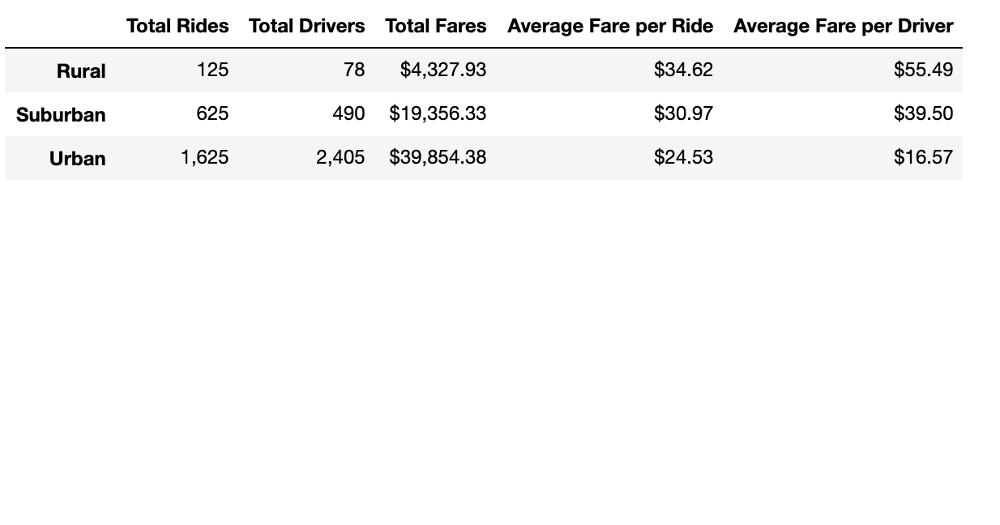

# PyBer_Analysis

## Overview 

The purpose of this analysis is to create a summary of the ride-sharing data by city type. Then we created a multiple-line graph to show the total weekly fares by each city type.

## Results: Using images from the summary DataFrame and multiple-line chart, describe the differences in ride-sharing data among the different city types.

The data is as you would expect. The more people in a given area, the greater the total fare earned in a week. So Urban areas earn more each week than suburban with rural areas earning the least amount in any given week. Each city type also seem to have the same difference each week. The following table provides a good summary of the results:

## Summary: Based on the results, provide three business recommendations to the CEO for addressing any disparities among the city types.

Here are my 3 recommendations:

1. The urban area has more drivers than rides during the time period. Meaning there are a lot of "drivers" that aren't actually driving people. This could be an indication that the drivers not driving aren't incentivized to drive. I would look at any drivers who aren't driving and see if there are any insights as to why. It could be that there notifications aren't working to let them know they could be driving. Maybe you need to send them reminders to drive. You might want to do a promotion to incentivize that first ride.

2. As mentioned earlier it makes sense that Urban areas have much greater amount of rides and drivers as there are a lot more people in urban cities and both decrease as you move out to less populous areas.

3. The Average Fare per drive is much greater in Rural regions compared to Suburban and Urban areas. This makes sense as people will take longer rides in rural areas as destinations are generally further away compared to a city in which people have shorter distances to travel.
